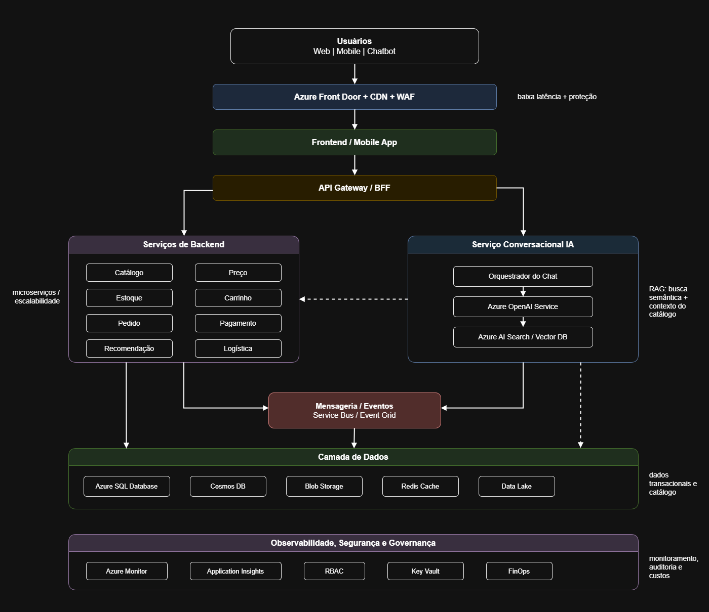
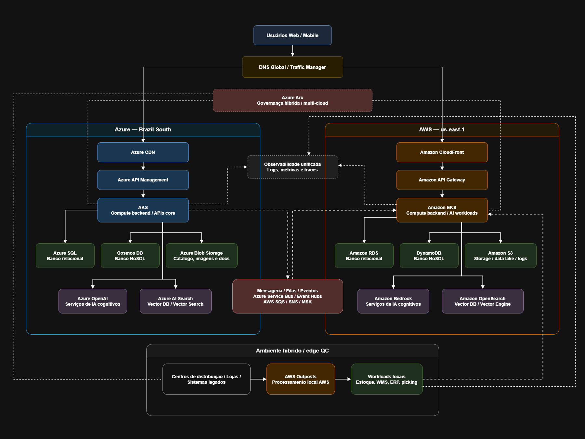

# Entrega Aula 01 — Grupo 02

**Disciplina:** Cloud & Cognitive Environments — FIAP MBA AI Engineering & Multi-Agents
**Turma:** 1AIER
**Data de entrega:** 07/06/2026

## Grupo

| # | Nome completo | GitHub | E-mail FIAP |
|---|---------------|--------|-------------|
| 1 | Filipe Borges de Figueiredo Chicre da Costa |  | rm371390@fiap.com.br |
| 2 | Lucas de Assis Fialho | https://github.com/lucasdafialho | rm370676@fiap.com.br |
| 3 | Rafael Peinado da Silva | https://github.com/rafaelpeinado | rm373803@fiap.com.br |

**Organization do grupo:** https://github.com/fiap-1aier-grupo-02


## Distribuição do trabalho

| Membro | Nível assumido | Item específico |
|--------|----------------|-----------------|
| Lucas de Assis | 🟢 N1 | Exercícios 1.1, 1.2 |
| Filipe Borges | 🟢 N1 | Exercícios 1.3, 1.4 |
| Rafael Peinado | 🟡 N2 | Exercício 2.1 |
| Filipe Borges | 🟡 N2 | Exercício 2.2, 2.3 |
| Lucas de Assis | 🔴 N3 (bônus) | Exercício 3.1, 3.2 |
| Rafael Peinado | 🔴 N3 (bônus) | Exercício 3.3 |

> Regra: cada membro deve ter pelo menos uma contribuição. O **rodízio entre aulas** (quem fez N1 antes faz N2 depois) é incentivado e vale o ponto do Critério 4 (ver [rubrica.md](rubrica.md)).

---

## 🟢 Nível 1 — Básico: Consolidando os Fundamentos

### Exercício 1.1 - Mapeamento de modelos de serviço

| Serviço | Modelo (IaaS/PaaS/SaaS/FaaS) | Justificativa |
|---------|------------------------------|---------------|
| Gmail | SaaS | É uma aplicação completa e pronta para o usuário final, ou seja, usuário apenas consome o serviço, sem gerenciar infraestrutura. |
| Azure Virtual Machines | IaaS | A Azure disponibiliza capacidade computacional virtualizada, mas a responsabilidade sobre OS, configurações, segurança da máquina e aplicações continua em grande parte com o cliente. |
| Azure App Service (hospedar uma API) | PaaS | O serviço abstrai a maior parte da infraestrutura. O cliente publica o código e configura a aplicação, enquanto a plataforma gerencia escalabilidade e operação base. |
| AWS Lambda | FaaS | É um modelo orientado a eventos, sem que o cliente precise manter servidores em execução contínua. É pago por requisição. |
| Azure SQL Database | PaaS | É um banco como serviço gerenciado. A administração de infraestrutura, disponibilidade, backups e manutenção do mecanismo de banco fica com a Azure, enquanto o cliente trabalha com dados, schemas e permissões. |
| Salesforce CRM | SaaS | O Salesforce fornece uma aplicação corporativa completa de CRM. A empresa contratante utiliza funcionalidades de negócio já prontas, sem desenvolver ou operar a plataforma base. |
| Google Kubernetes Engine (GKE) | PaaS/IaaS | O Google Cloud Platform reduz o esforço operacional ao gerenciar partes do Kubernetes. Ainda assim, o cliente continua responsável por workloads, imagens, configurações, escalabilidade e segurança dos componentes implantados. |
| Azure Blob Storage | PaaS | É um serviço gerenciado para armazenamento de objetos. O cliente não administra discos ou servidores de storage, mas configura containers, permissões, ciclo de vida e organização dos dados. |
| Azure OpenAI Service | SaaS | A capacidade de IA é consumida por meio de APIs gerenciadas. O cliente integra os modelos à aplicação, mas não opera diretamente a infraestrutura de treinamento, hospedagem ou escalabilidade dos modelos. |


### Exercício 1.2 - Os 6 Rs na prática

- **Cenário A:** Rehost, pois o sistema é antigo e pouco documentado, então uma mudança aumentaria muito o risco. Para garantir agilidade, ganhar elasticidade e evitar riscos, o ideal seria primeiro migrar a infraestrutura para nuvem com o mínimo de alteração no código e futuramente modernizar a aplicação.
- **Cenário B:** Retire, pois existem poucos usuários ativos com dados raramente consultados o que não justifica o esforço de migração, sustentação e modernização.
- **Cenário C:** Refactor, pois existe a decisão de reescrever a arquitetura saindo de uma API monolítica para uma arquitetura baseada em microsserviços, Kubernetes e event-driven indicando uma transformação estrutural. Sendo assim, não seria apenas uma movimentação para nuvem.
- **Cenário D:** Repurchase, pois quando uma solução SaaS do mercado já atende a maior partes das necessidades com menor custo. A substituição permite reduzir manutenção de código legado e concentrar o time interno em capacidades mais estratégicas.
- **Cenário E:** Retain, pois a permanência em mainframe no ambiente atual é determinada por restrição regulatória, o que impede a migração dos dados.


### Exercício 1.3 - Calculando o impacto do SLA
#### a) Downtime anual
Downtime = 8.760 × (1 − 99,9/100)
Downtime = 8.760 × (1 − 0,999)
Downtime = 8.760 × 0,001
Downtime = 8,76 horas/ano


#### b) Impacto financeiro máximo
Impacto = 8,76 h × R$ 50.000/h
Impacto = R$ 438.000/ano

#### c) Para limitar o impacto a menos de R$ 50.000/ano, o downtime máximo permitido seria
Downtime máximo = R$ 50.000 ÷ R$ 50.000/h
Downtime máximo = 1 hora/ano

1 = 8.760 × (1 − SLA)
1 ÷ 8.760 = 1 − SLA
0,00011416 = 1 − SLA
SLA = 0,99988584
SLA = 99,98858%

Logo, o SLA mínimo necessário seria de aproximadamente 99,9886%. Na prática, o contrato comercial mais próximo seria 99,99%, que representa cerca de 52,56 minutos de downtime por ano.


### Exercício 1.4 - RBAC na prática

As respostas estão de acordo com a adoção do Menor Privilégio. Ou seja, cada identidade recebe apenas o acesso necessário para executar a sua função.

| Perfil | Role Azure mais adequada | Justificativa |
|--------|--------------------------|---------------|
| Agente de IA que LÊ produtos do Storage para responder ao cliente | Storage Blob Data Reader | O agente precisa apenas consultar informações no catálogo, mas não deve alterar arquivos ou políticas do Storage. Essa permissão limita o acesso à leitura dos blobs, reduzindo o impacto caso a identidade seja comprometida. |
| Engenheiro de dados que CARREGA novos catálogos no Blob | Storage Blob Data Contributor | Esse perfil permite enviar, atualizar e organizar arquivos de catálogo no Blob Storage. |
| Time de FinOps que precisa VER custos sem alterar recursos | Cost Management Reader | Geralmente equipe de FinOps analisa gastos por assinatura/RG e essa role mantém o escopo exatamente nesse nível sem dar acesso a conta de faturamento inteira. |
| Auditor externo que precisa LER configurações de toda a assinatura | Reader | Para auditoria, o acesso deve permitir inspeção de leitura dos recursos e configurações, sem capacidade de alteração. |
| Sistema de CI/CD que provisiona infraestrutura via Terraform | Contributor | Precisa ser associado a um Resource Group específico, pois a pipeline precisa criar e atualizar recursos definidos como código, mas a permissão precisa ser restrita ao escopo do projeto. Limitar o Contributor ao RG reduz o risco de alterações acidentais ou indevidas em outros ambientes. |

---

## 🟡 Nível 2 — Intermediário: Análise e Estratégia

### Exercício 2.1 - Arquitetura de alto nível: Quantum Commerce

#### 1. Camadas da arquitetura
- **Camada de Usuário (Front-end)**
  - Aplicação web
  - Aplicativo mobile
  - Chatbot
  - Assistente de compras com IA

- **Camada de Borda, Segurança e Distribuição**
  - Roteamento global
  - Proteção de DDoS
  - WAF
  - Cache de conteúdo estático
  - TLS/HTTPS
  - CDN
- **Camada de APIs e Integração**
  - API Gateway
  - BFF para web/mobile
  - Autenticação e autorização
  - Versionamento de APIs
  - Integração com sistemas internos
  - Rate limiting
- **Camada de Backend e Domínio**
  - Microsserviços de: catálogo, preço, estoque, carrinho, pagamento, pedidos, recomendação para escalarem de forma independente
- **Camada de Dados**
  - NoSQL para catálogo
  - Relacional para pedidos, pagamentos e transações
  - Vetorial para armazenamento e recuperação do RAG
  - Cache distribuído para reduzir latência
  - Object storage para imagens, descrições e documentos.
- **Camada de IA e RAG**
  - IA Conversacional como assistente de compras
  - Busca vetorial das SKUs
  - Filtros de segurança
  - Orquestrador de prompts
  - Integração com APIs de estoque, preço e recomendação
- **Camada de Mensageria e Eventos**
  - Responsável por desacoplar serviços e suportar processamentos assíncronos
    - Compras, pedidos, pagamento aprovado, recomendação gerada
- **Camada de Observabilidade e Segurança**
  - Logs, métricas e tracing
  - Alertas
  - Dashboards
  - Gestão de custos
  - RBAC
  - Auditoria
  - Políticas de segurança


#### 2. Provedor principal
O provedor principal escolhido seria **Microsoft Azure**, pois oferece serviços maduros para aplicações corporativas. Em destaque requisito de AI Conversacional o Azure OpenAI Service facilita a criação de soluções baseadas em LLM com compliance, inclusive multi país, e monitoramento.


#### 3. Serviços por categoria
| Categoria | Serviço Azure | Alternativa AWS | Alternativa GCP |
|-----------|--------------|-----------------|-----------------|
| Compute (backend) | Azure Kubernetes Service | Amazon Elastic Kubernetes Service | Google Kubernetes Engine |
| Storage (catálogo, imagens) | Azure Blob Storage | Amazon S3 | Google Cloud Storage |
| Banco relacional | Azure SQL Database | Amazon RDS | Cloud SQL |
| Banco NoSQL | Azure Cosmos DB | Amazon DynamoDB | Firestore |
| Vector Database | Azure AI Search | Amazon OpenSearch | Vertex AI Vector Search |
| Serviços de IA cognitivos | Azure OpenAI Service | Amazon Bedrock | Vertex AI |
| CDN | Azure CDN | Amazon CloudFront | Cloud CDN |
| Mensageria/Filas | Azure Service Bus | SQS | Pub/Sub |
| Observabilidade (logs/métricas) | Azure Monitor | CloudWatch | Cloud Monitoring |

#### 4. Diagrama

O diagrama abaixo representa a arquitetura de alto nível da Quantum Commerce, contemplando as camadas de front-end, borda/CDN, APIs, backend em AKS, dados, IA/RAG, mensageria e observabilidade.




### Exercício 2.2 - Comparativo de custos: 3 provedores
// TODO
| Item | Azure | AWS | GCP | Notas |
|------|-------|-----|-----|-------|
| 2 × VM (2vCPU/8GB) | 140,16 | | | Tipo: Azure: D2s v5; AWS: t3.large; GCP: e2-standard-2 |
| 500 GB storage | |  | | Tipo: |
| Banco gerenciado | | | | Tipo: |
| 10M req serverless | | | | Tipo: |
| **Total mensal** | | | | |
| **Total anual** | | | | |


### Exercício 2.3 - Estratégia de migração para sua empresa
#### a) Sistema/workload

O workload escolhido é um **módulo de consolidação de internações hospitalares e faturamento**. Atualmente, uma rede de saúde recebe diariamente arquivos Excel enviados por e-mail ou FTP por hospitais parceiros. Esses arquivos contêm informações sobre internações, altas, procedimentos e óbitos.

O processo atual é manual: um analista baixa os arquivos, valida os dados visualmente e copia as informações para um sistema central. Esse modelo gera riscos de erro humano, atraso no faturamento, baixa rastreabilidade e fragilidade em relação à segurança e à LGPD, pois os arquivos contêm dados sensíveis de pacientes.

#### b) Estratégia dos 6 Rs

A estratégia escolhida é **Replatform**.

A ideia não é reescrever todo o sistema de faturamento, mas modernizar a forma como os arquivos são recebidos, validados e processados. O processo manual seria substituído por uma esteira automatizada em nuvem, mantendo inicialmente o formato de arquivo já usado pelos hospitais.

**Justificativa:**

* **Custo:** baixo a moderado, pois a solução usa serviços gerenciados e serverless, pagando conforme o uso.
* **Risco:** menor do que uma reescrita completa, pois os hospitais continuam enviando arquivos Excel no modelo conhecido.
* **Ganho:** alto, com redução de erros manuais, validação automática, auditoria, rastreabilidade e processamento mais rápido.
* **Prazo:** curto, pois é possível entregar um MVP em poucas semanas sem alterar todo o sistema legado de faturamento.

#### c) Serviços Azure e estimativa mensal

A solução poderia utilizar os seguintes serviços Azure:

| Serviço                              | Uso na solução                                                    | Estimativa          |
| ------------------------------------ | ----------------------------------------------------------------- | ------------------- |
| Azure Blob Storage                   | Recebimento e armazenamento dos arquivos enviados pelos hospitais | US$ 5 a US$ 10/mês  |
| Event Grid                           | Disparo automático de evento quando um novo arquivo for enviado   | Baixo custo         |
| Azure Functions                      | Leitura do Excel, validação dos dados e gravação no banco         | US$ 10 a US$ 20/mês |
| Azure SQL Database serverless        | Armazenamento dos dados validados de internações e faturamento    | US$ 45 a US$ 90/mês |
| Logic Apps                           | Envio de notificações para hospitais e analistas em caso de erro  | US$ 5 a US$ 15/mês  |
| Azure Monitor / Application Insights | Logs, métricas, auditoria técnica e rastreabilidade               | US$ 5 a US$ 20/mês  |
| Key Vault                            | Armazenamento seguro de segredos, chaves e credenciais            | Baixo custo         |

**Estimativa mensal inicial:** aproximadamente **US$ 70 a US$ 150/mês**, dependendo do volume de arquivos, tempo de execução das funções, retenção de logs e configuração do banco.

#### d) Maior obstáculo técnico ou organizacional

O maior obstáculo técnico é a **baixa qualidade e falta de padronização dos dados enviados pelos hospitais**. Cada hospital pode preencher as planilhas de forma diferente, com formatos distintos de data, campos obrigatórios ausentes, CPF inválido, códigos de procedimentos inconsistentes ou colunas fora do padrão.

Para endereçar esse problema, a solução deve usar uma esteira de validação com camadas de dados:

* **Bronze:** armazenamento do arquivo original exatamente como foi recebido.
* **Silver:** dados limpos, padronizados e validados.
* **Rejeitados/quarentena:** arquivos ou registros com erro, acompanhados do motivo da falha.

A Azure Function aplicaria validações de schema, formato e regras de negócio, como CPF válido, datas coerentes e campos obrigatórios preenchidos. Em caso de erro, o arquivo ou a linha inconsistente seria enviado para uma área de rejeição, e o hospital receberia uma notificação automática com o motivo da falha.

Também seriam aplicadas práticas de segurança, como criptografia dos dados, RBAC, Managed Identity, Key Vault e logs de auditoria, devido à sensibilidade dos dados hospitalares e às exigências da LGPD.

Com isso, o banco central recebe apenas dados validados, o processo se torna auditável e o time administrativo reduz o esforço manual de conferência e correção.


---

## 🔴 Nível 3 — Bônus

### Exercício 3.1 — Terraform: endurecer a segurança de rede da VM
// TODO

### Exercício 3.2 — Bicep equivalente
// TODO

### Exercício 3.3 Desafio de arquitetura: multi-cloud para a Quantum Commerce
#### a) Arquitetura multi-cloud e justificativa dos workloads



A arquitetura proposta utiliza **Azure e AWS** para reduzir o risco de lock-in e distribuir os workloads conforme suas características. O **Azure** foi definido como nuvem principal para o core transacional da Quantum Commerce, enquanto a **AWS** atua como nuvem complementar para workloads de recomendação, IA, analytics, data lake e contingência. A tabela também apresenta alternativas equivalentes em **GCP**, caso a empresa avalie uma terceira opção no futuro.

No **Azure**, ficam os componentes mais críticos da jornada de compra: **Azure Kubernetes Service** para os backends, **Azure SQL Database** para dados relacionais, **Azure Cosmos DB** para dados NoSQL, **Azure Blob Storage** para catálogo e imagens, **Azure AI Search** para busca vetorial, **Azure OpenAI Service** para IA generativa/conversacional, **Azure CDN** para distribuição de conteúdo, **Azure Service Bus** para mensageria e **Azure Monitor** para observabilidade. Essa escolha concentra no Azure os serviços ligados a catálogo, pedidos, clientes, checkout e atendimento inteligente, simplificando governança e reduzindo latência para o core transacional.

Na **AWS**, ficam workloads mais desacoplados do caminho crítico da compra, como recomendação, personalização, machine learning, processamento analítico e armazenamento auxiliar. Para isso, a arquitetura utiliza **Amazon Elastic Kubernetes Service**, **Amazon S3**, **Amazon RDS**, **Amazon DynamoDB**, **Amazon OpenSearch**, **Amazon Bedrock**, **Amazon CloudFront**, **SQS** e **CloudWatch**. Essa separação permite explorar recursos de IA e analytics da AWS sem tornar o checkout e os pedidos dependentes de chamadas síncronas entre nuvens.

A integração entre Azure e AWS deve ocorrer por **mensageria e eventos**, usando **Azure Service Bus** e **SQS**. Dessa forma, eventos de catálogo, pedidos, navegação e recomendação podem ser trocados de maneira assíncrona, reduzindo impacto de latência e aumentando a resiliência da arquitetura.

A observabilidade fica centralizada com **Azure Monitor** e **CloudWatch**, permitindo acompanhar logs, métricas e traces dos workloads distribuídos. Como extensão avançada, o **Azure Arc** pode apoiar a governança híbrida/multi-cloud, enquanto o **AWS Outposts** pode ser usado em centros de distribuição, lojas ou ambientes legados que precisam de processamento local e baixa latência.

Com essa divisão, o **Azure** concentra o core transacional do e-commerce, a **AWS** complementa com workloads de IA, analytics e edge, e o **GCP** permanece como referência de alternativas equivalentes para uma possível expansão multi-cloud futura.


#### b) Desafios principais da arquitetura multi-cloud

**1. Latência entre nuvens**
Como a arquitetura utiliza Azure e AWS, chamadas síncronas entre os provedores podem aumentar o tempo de resposta, principalmente se um serviço crítico no Azure depender de uma resposta imediata de um serviço na AWS. Isso pode impactar fluxos sensíveis como checkout, consulta de estoque e recomendação em tempo real. Para reduzir esse risco, a comunicação entre clouds deve ser assíncrona, baseada em eventos e filas, evitando dependência direta no caminho crítico da compra.

**2. Identidade unificada**
Cada provedor possui seu próprio modelo de identidade e controle de acesso, como Microsoft Entra ID no Azure e IAM na AWS. Isso pode dificultar a gestão de permissões, auditoria e aplicação do princípio de menor privilégio. A mitigação envolve usar federação de identidade, SSO, RBAC bem definido, service accounts específicas para workloads e políticas centralizadas de acesso.

**3. Custos de egress**
A transferência de dados entre clouds pode gerar custos elevados, principalmente quando grandes volumes trafegam entre Azure e AWS. Em uma empresa como a Quantum Commerce, eventos de catálogo, imagens, logs, dados de clientes e datasets de IA podem aumentar rapidamente esse custo. Para controlar o egress, a arquitetura deve evitar replicações desnecessárias, trafegar apenas dados essenciais, usar compressão, processar dados próximos de onde são armazenados e priorizar eventos em vez de cópias completas.

**4. Observabilidade**
Em uma arquitetura multi-cloud, logs, métricas e traces ficam distribuídos entre serviços do Azure, AWS e ambientes híbridos/edge. Isso dificulta a identificação de falhas, gargalos e degradação de performance ponta a ponta. Para resolver isso, é necessário adotar observabilidade unificada, com correlação por trace-id, padronização via OpenTelemetry, dashboards centralizados e alertas integrados para acompanhar toda a jornada da requisição entre os ambientes.


#### c) Comparação entre ferramentas IaC multi-cloud

| Critério                         | Terraform                                                                                                                                                                                                                                                                                                                                                      | Pulumi                                                                                                                                                                                    |
| -------------------------------- | -------------------------------------------------------------------------------------------------------------------------------------------------------------------------------------------------------------------------------------------------------------------------------------------------------------------------------------------------------------- | ----------------------------------------------------------------------------------------------------------------------------------------------------------------------------------------- |
| Linguagem                        | Usa **HCL**, uma linguagem declarativa própria para infraestrutura.                                                                                                                                                                                                                                                                                            | Usa linguagens de programação como **TypeScript, Python, Go, C#, Java e YAML**.                                                                                                           |
| Pricing                          | O Terraform CLI é open source. Para uso gerenciado, o **HCP Terraform** possui planos pagos por recurso gerenciado, com plano Essentials a partir de **US$ 0,10 por recurso/mês**.                                                                                                                                                                             | O Pulumi CLI é open source. O **Pulumi Cloud** possui plano gratuito individual e planos pagos para times/empresas, com recursos de colaboração, gestão de estado, policies e automações. |
| Suporte aos 3 grandes provedores | Suporta **Azure, AWS e GCP** por meio de providers oficiais e da comunidade no Terraform Registry.                                                                                                                                                                                                                                                             | Suporta **Azure, AWS e GCP**, além de Kubernetes e outros provedores, usando SDKs e providers do ecossistema Pulumi.                                                                      |
| Modelo de uso                    | Mais declarativo, focado em descrever o estado desejado da infraestrutura.                                                                                                                                                                                                                                                                                     | Mais programável, permitindo criar abstrações, funções, classes e componentes reutilizáveis.                                                                                              |
| Quando escolher                  | Quando o objetivo for padronização corporativa, ampla adoção de mercado, muitos módulos prontos, facilidade de encontrar profissionais e forte suporte multi-cloud. É adequado para governança de infraestrutura em múltiplas clouds.                             | Quando o time tiver perfil mais próximo de engenharia de software e quiser usar linguagens como TypeScript ou Python para criar infraestrutura com mais abstração, reutilização de código, testes e integração com práticas de desenvolvimento. É interessante para squads de plataforma que querem tratar infraestrutura como software. |


#### d) Estimativa de custo de egress entre Azure Brazil South e AWS us-east-1

Para estimar o custo de egress, foi considerado que a cobrança ocorre na **nuvem de origem dos dados**, ou seja, quando os dados saem de um provedor em direção ao outro.

Como o diagrama propõe uma integração bidirecional entre Azure e AWS por mensageria/eventos, a estimativa considera:

* **10 TB/mês saindo do Azure Brazil South para AWS us-east-1**
* **10 TB/mês saindo da AWS us-east-1 para Azure Brazil South**

Para os cálculos, foi considerado o desconto de **100 GB gratuitos por mês** em cada provedor.

---

##### 1. Azure Brazil South → AWS us-east-1

Para o tráfego saindo do Azure, foi utilizada a tabela de **Azure Bandwidth Pricing**, considerando saída de dados da região **South America**.

```text
Volume total: 10.000 GB
Franquia gratuita: 100 GB
Volume cobrado: 9.900 GB

Preço estimado: US$ 0,181/GB

Cálculo:
9.900 × 0,181 = US$ 1.791,90/mês
```

**Custo estimado Azure → AWS:** **US$ 1.791,90/mês**

---

##### 2. AWS us-east-1 → Azure Brazil South

Para o tráfego saindo da AWS, foi utilizada como referência a tabela de **Data Transfer Out** publicada na página de pricing do **Amazon EC2**, considerando saída de dados da região **us-east-1** para fora da AWS.

```text
Volume total: 10.000 GB
Franquia gratuita: 100 GB
Volume cobrado: 9.900 GB

Preço estimado: US$ 0,09/GB

Cálculo:
9.900 × 0,09 = US$ 891,00/mês
```

**Custo estimado AWS → Azure:** **US$ 891,00/mês**

---

##### 3. Custo total bidirecional

```text
Azure → AWS: US$ 1.791,90/mês
AWS → Azure: US$   891,00/mês

Total estimado: US$ 2.682,90/mês
```

Portanto, considerando **10 TB/mês em cada sentido**, o custo total estimado de egress entre **Azure Brazil South** e **AWS us-east-1** é de aproximadamente **US$ 2.682,90 por mês**.

Essa estimativa serve como cálculo base. Em um cenário real, o valor pode variar conforme o serviço de origem dos dados, uso de CDN, NAT Gateway, links dedicados, compactação, volume real trafegado e possíveis acordos comerciais com os provedores.


---

## Reflexão coletiva

Nesta primeira aula, o grupo aprendeu que cloud não é apenas contratar serviços de infraestrutura, mas tomar decisões arquiteturais considerando modelo de serviço, custo, segurança, disponibilidade e governança. Os exercícios de IaaS, PaaS, SaaS, FaaS, 6 Rs, SLA e RBAC ajudaram a conectar conceitos básicos com decisões práticas de arquitetura.

No contexto da Quantum Commerce, ficou claro que uma plataforma de AI Engineering precisa ser desenhada em camadas bem definidas: front-end, APIs, backend, dados, IA/RAG, mensageria, observabilidade e segurança. Para uma solução com agentes inteligentes, essa separação é importante porque os agentes dependem de ferramentas, dados confiáveis, permissões bem controladas e infraestrutura reproduzível.

Também percebemos que decisões de custo e disponibilidade precisam ser analisadas desde o início. O comparativo entre provedores mostra que preço varia bastante conforme região, tipo de VM, banco gerenciado e modelo serverless. Já o cálculo de SLA mostrou que pequenas diferenças percentuais podem representar muitas horas de indisponibilidade e impacto financeiro relevante.

Se começássemos o projeto QC, tomaríamos cuidado para separar desde o início o core transacional dos workloads de IA e analytics. O core de pedidos, clientes e pagamentos deve priorizar consistência, baixa latência e segurança, enquanto os componentes de recomendação, RAG e análise de comportamento podem ser mais assíncronos, escaláveis e orientados a eventos.

---


## Artefatos do ZIP

- Documento principal: `entrega-grupo-02-aula01.md`
- Diagrama da arquitetura QC: `diagramas/arquitetura-qc-aula01.png`
- Diagrama bônus multi-cloud: `diagramas/arquitetura-qc-aula01-bonus.png`
- Código IaC: `terraform/`
- Endpoint ativo (se houver): URL pública sem credenciais — apenas para demonstração durante a janela de correção
