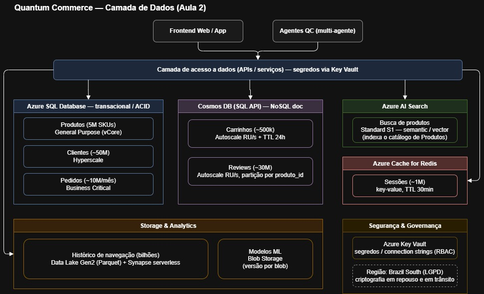

# Entrega Aula 02 — Grupo 02

**Disciplina:** Cloud & Cognitive Environments — FIAP MBA AI Engineering & Multi-Agents
**Turma:** 1AIER
**Data de entrega:** 14/06/2026

## Grupo

| # | Nome completo | GitHub | E-mail FIAP |
|---|---------------|--------|-------------|
| 1 | Filipe Borges de Figueiredo Chicre da Costa |  | rm371390@fiap.com.br |
| 2 | Lucas de Assis Fialho | https://github.com/lucasdafialho | rm370676@fiap.com.br |
| 3 | Rafael Peinado da Silva | https://github.com/rafaelpeinado | rm373803@fiap.com.br |

**Organization do grupo:** https://github.com/fiap-1aier-grupo-02


## Distribuição do trabalho
| Membro | Nível assumido | Item específico |
|--------|----------------|-----------------|
| Rafael Peinado | 🟢 N1 | Exercícios 1.1, 1.2, 1.3, 1.4 |
| Filipe Borges | 🟡 N2 | Exercício 2.1 |
| Lucas de Assis | 🟡 N2 | Exercício 2.2, 2.3 |
| Rafael Peinado | 🔴 N3 (bônus) | Exercício 3.1, 3.2, 3.3 |

> Regra: cada membro deve ter pelo menos uma contribuição. O **rodízio entre aulas** (quem fez N1 antes faz N2 depois) é incentivado e vale o ponto do Critério 4 (ver [rubrica.md](rubrica.md)).

---

## 🟢 Nível 1 — Básico: Consolidando os Fundamentos

### Exercício 1.1 — Tipos de Storage

| Cenário                                                                | Tipo           | Justificativa                                                                                                                                                  |
| ---------------------------------------------------------------------- | -------------- | -------------------------------------------------------------------------------------------------------------------------------------------------------------- |
| Hospedar imagens de produtos do e-commerce QC, considerando 5M de SKUs | Object Storage | É o modelo mais adequado para armazenar grande volume de arquivos estáticos acessados via HTTP/URL, com boa escalabilidade e baixo acoplamento com servidores. |
| Disco onde roda o sistema operacional de uma VM de banco               | Block Storage  | O sistema operacional de uma VM precisa de baixa latência, operações de leitura/escrita em bloco e disco diretamente associado à máquina virtual.              |
| Pasta compartilhada entre 10 VMs de um time de DevOps                  | File Storage   | Permite montar o mesmo compartilhamento em múltiplas VMs simultaneamente, funcionando como uma pasta de rede gerenciada.                                       |
| Backup mensal de bancos de dados com retenção de 7 anos                | Object Storage | Backups de longa retenção têm acesso raro e se beneficiam de tiers frios, como Cool ou Archive, reduzindo muito o custo.                                       |
| Storage de modelos `.pkl` do time de ML para serving                   | Object Storage | Modelos de ML são artefatos versionáveis que podem ser armazenados como objetos e baixados pela aplicação ou pipeline de serving quando necessário.            |
| Dump diário de logs de aplicação para análise futura                   | Object Storage | Logs históricos podem ser gravados em Blob Storage e movidos por lifecycle policy para tiers mais baratos conforme envelhecem.                                 |

---

### Exercício 1.2 — Tiers de acesso
**Considerando:**
* 2 TB = 2.048 GB

#### a) Custo mensal mantendo 100% em Hot tier
```text
2.048 GB × US$ 0,018 = US$ 36,86/mês
```

Portanto, o custo mensal seria de aproximadamente:

```text
US$ 36,86/mês
```

Custo anual:

```text
US$ 36,86 × 12 = US$ 442,32/ano
```

---

#### b) Custo mensal com lifecycle: 30 dias Hot + Archive depois

Considerando uma visão média anual em steady state:

```text
Hot:     2.048 × 30/365 × 0,018 = US$ 3,03/mês
Archive: 2.048 × 335/365 × 0,002 = US$ 3,76/mês
```

Total mensal aproximado:

```text
US$ 3,03 + US$ 3,76 = US$ 6,79/mês
```

---

#### c) Economia anual com lifecycle policy

```text
Economia mensal = US$ 36,86 - US$ 6,79 = US$ 30,07
Economia anual  = US$ 30,07 × 12 = US$ 360,84/ano
```

A economia anual aproximada seria:

```text
US$ 360,84/ano
```

Em um cenário real com dezenas ou centenas de TB de logs, a política de lifecycle teria impacto financeiro muito relevante.

---

### Exercício 1.3 — Relacional vs NoSQL

| Caso de uso                                      | Relacional — Azure SQL | NoSQL doc — Cosmos DB | Vector DB — Azure AI Search | Justificativa                                                                                                                                                        |
| ------------------------------------------------ | ---------------------: | --------------------: | --------------------------: | -------------------------------------------------------------------------------------------------------------------------------------------------------------------- |
| Carrinho de compras ativo do usuário             |                        |                     X |                             | Carrinhos têm estrutura flexível, precisam de baixa latência e podem expirar automaticamente com TTL.                                                                |
| Catálogo de produtos com SKU, preço e estoque    |                      X |                       |                             | Produtos, preços e estoque exigem consistência, integridade e consultas estruturadas, especialmente em operações comerciais críticas.                                |
| Reviews dos clientes (com texto livre + score)    |                        |                     X |                             | Reviews possuem texto livre, estrutura menos rígida e alto volume, sendo adequadas para documentos JSON.                                                             |
| "Encontre produtos similares a este" (recomendação)            |                        |                       |                           X | Busca por similaridade depende de embeddings e comparação semântica, caso típico de vector search.                                                                   |
| Histórico de pedidos para faturamento            |                      X |                       |                             | Pedidos usados em faturamento exigem transações ACID, rastreabilidade e consistência forte.                                                                          |
| Sessão do usuário (chave-valor, expira em 30 min) |                        |                     X |                             | Sessões são dados temporários, acessados por chave e com expiração curta. Cosmos com TTL atende, embora Azure Cache for Redis também fosse uma opção muito adequada. |
| Logs de comportamento de navegação               |                        |                     X |                             | Clickstream tem grande volume, escrita intensa e estrutura variável. Pode ir para Cosmos em cenários operacionais ou Blob/Data Lake para análise histórica.          |

---

### Exercício 1.4 — Key Vault e RBAC

| Perfil                                                                     | Role no Key Vault                        | Justificativa                                                                                                                                         |
| -------------------------------------------------------------------------- | ---------------------------------------- | ----------------------------------------------------------------------------------------------------------------------------------------------------- |
| Você (criador do Vault, faz dev e ops)                                      | Key Vault Secrets Officer                | Permite criar, atualizar, listar e remover segredos sem conceder permissões excessivas como Owner no recurso inteiro.                                 |
| Azure Function que consulta `T_PRODUTOS` e precisa ler a connection string | Key Vault Secrets User                   | A Function deve apenas ler o valor do segredo em tempo de execução, idealmente usando Managed Identity.                                               |
| Engenheiro de segurança que audita os segredos sem alterá-los              | Key Vault Reader                         | Permite visualizar metadados do Key Vault sem acessar o valor dos segredos, adequado para auditoria sem exposição indevida.                           |
| Pipeline de CI/CD que injeta novos segredos automaticamente                | Key Vault Secrets Officer                | O pipeline precisa criar ou atualizar segredos, mas a permissão deve ser limitada ao escopo necessário e associada a um Service Principal específico. |
| Time de FinOps que precisa ver custo do Vault sem ver segredos             | Reader no Resource Group ou Subscription | O time de FinOps precisa acessar informações de custo e recurso, mas não deve ter permissão no plano de dados dos segredos.                           |

---

## 🟡 Nível 2 — Intermediário: Decisões Arquiteturais

### Exercício 2.1 — Modelagem de dados da QC

| Domínio                          | Serviço Azure                | SKU / Configuração                             | Justificativa                                                                                                                          |
| --------------------------------- | ---------------------------- | ---------------------------------------------- | ------------------------------------------------------------------------------------------------------------------------------------- |
| Produtos (5M SKUs)                | Azure SQL Database           | General Purpose, vCore (Hyperscale se crescer) | Schema fixo, joins com categorias e integridade do estoque. A leitura pesada de busca/listagem vai pro AI Search, não direto aqui.     |
| Clientes (~50M)                   | Azure SQL Database           | Hyperscale                                     | Dado estruturado com relacionamento (perfil, endereço, preferências), e Hyperscale aguenta o volume sem virar um monólito travado.    |
| Pedidos (~10M/mês)                | Azure SQL Database           | Business Critical                              | Alta criticidade transacional: precisa de ACID e baixa latência de escrita pra faturamento.                                           |
| Carrinhos (~500k, 24h)            | Cosmos DB (SQL API)          | Autoscale RU/s + TTL de 24h                    | Schema flexível por usuário, leitura por chave rápida e expiração automática sem job de limpeza.                                       |
| Reviews (~30M)                    | Cosmos DB (SQL API)          | Autoscale RU/s, partição por `produto_id`      | Texto livre sem schema rígido e muita escrita. Alimenta a análise de sentimento depois.                                               |
| Busca de produtos                 | Azure AI Search              | Standard S1, com semantic/vector               | Busca semântica e ranking dos agentes e do frontend; é o read path do catálogo.                                                       |
| Sessões (~1M)                     | Azure Cache for Redis        | Standard/Premium                               | Key-value de altíssima frequência com latência sub-ms e expiração nativa. Cosmos com TTL serve, mas Redis é mais barato pra esse padrão. |
| Histórico navegação (bilhões)     | Azure Data Lake Storage Gen2 | Standard, Hot→Cool, Parquet                    | Clickstream só de append; ingestão barata e dá pra rodar Synapse serverless por cima sem ETL.                                          |
| Modelos ML                        | Blob Storage                 | Standard, versionamento por blob               | Artefatos imutáveis baixados no serving. (Em produção daria pra usar o registry do Azure ML por cima.)                                |

**Diagrama da camada de dados:**



> Consumidores (frontend + agentes) acessam tudo pela camada de acesso a dados, que resolve os segredos no Key Vault. Cada domínio cai no serviço adequado: transacional no Azure SQL, documentos no Cosmos, busca no AI Search, sessões no Redis, e clickstream/modelos no Storage & Analytics. Segurança e residência de dados (LGPD / Brazil South) ficam como camada transversal.

---

### Exercício 2.2 — Plano de migração de dados

Os três repositórios de origem hoje:

* Oracle on-premise, 8 TB (produtos + pedidos + clientes)
* 50 TB de imagens num NAS local
* 200 TB de logs em fita (compliance fiscal)

#### a) Qual dos 6 Rs pra cada um

* **Oracle 8 TB:** Rehost/Replatform conservador do banco inteiro, mantendo produtos, pedidos e clientes juntos no primeiro movimento. O destino inicial seria Oracle em Azure VM ou serviço Oracle gerenciado disponível no ecossistema Azure, preservando compatibilidade, transações críticas e menor risco de cutover. Após estabilização, a QC poderia refatorar domínios menos críticos de forma incremental, mas sem dividir o banco crítico na primeira migração.
* **Imagens (50 TB):** Replatform de NAS pra Blob (Object Storage). Não é um lift-and-shift puro porque muda o tipo de storage, mas o dado em si vai como está.
* **Logs em fita (200 TB):** Replatform pro Archive tier do Blob. Em vez de manter a fita (Retain), sobe pro Archive, que cumpre o compliance fiscal com custo baixo e acesso muito mais simples que a fita.

#### b) Serviços Azure de destino

| Origem       | Destino               | Por quê                                                                  |
| ------------ | --------------------- | ------------------------------------------------------------------------ |
| Oracle       | Azure SQL MI + Cosmos | MI pro transacional crítico, Cosmos pros domínios de schema flexível.    |
| Imagens NAS  | Blob Hot/Cool + CDN   | Acesso por HTTP, tier por frequência de acesso, CDN reduz egress.        |
| Logs em fita | Blob Archive          | Custo mínimo pra dado de retenção longa e acesso raro.                   |

#### c) Como migrar sem downtime

Pro Oracle, usar o **Azure Database Migration Service** em modo online: ele replica continuamente as mudanças do banco de origem enquanto a aplicação segue rodando. Quando origem e destino estão sincronizados, faz a validação e o cutover numa janela curtíssima, só apontando a aplicação pro novo endpoint.

Pras imagens e logs, **AzCopy** com transferência paralela. Pros 50 TB de imagens, transferir pela internet leva semanas, então o caminho prático é o **Azure Data Box** (appliance físico que a Microsoft envia, você copia os dados localmente e devolve).

#### d) Estimativa de custo de egress (50 TB de imagens)

Importante separar as direções: levar o dado do NAS local pra Azure é **ingress**, que é gratuito. O egress só pesa depois, quando as imagens forem servidas aos usuários saindo da Azure.

A 50 TB ≈ 51.200 GB, com egress na faixa de US$ 0,08–0,09/GB nos primeiros TB, daria algo na casa de **US$ 4.000–4.500 se tudo saísse uma vez**. Na prática isso não acontece: com CDN na frente, a maioria das requisições é servida do cache de borda e o egress real cai bastante. Por isso o desenho usa Blob + CDN, não Blob puro.

#### e) Compliance LGPD

Dados de brasileiros ficam nas regiões **Brazil South (São Paulo)** ou **Brazil Southeast**, garantindo residência de dados no país. Soma-se criptografia em repouso e em trânsito, RBAC de menor privilégio e log de acesso. Os logs fiscais no Archive seguem a mesma regra de região.

---

### Exercício 2.3 — Particionamento no Cosmos DB

#### a) Por que NÃO seriam boas partition keys

**`id` da review (3 razões):**

1. Cardinalidade altíssima com 1 documento por partição lógica, então não agrupa nada de útil.
2. A query mais comum ("reviews deste produto") vira cross-partition, fazendo fan-out em todas as partições e custando muito RU.
3. Some o benefício de localidade de dados que é o motivo de existir a chave de partição.

**`score` (1-5), 2 razões:**

1. Só 5 valores possíveis = cardinalidade baixíssima, então o dado se concentra em pouquíssimas partições lógicas (hot partition).
2. Estoura o limite de 20 GB por partição lógica rápido, porque milhões de reviews caem em apenas 5 buckets.

**`data_da_review` (timestamp), 2 razões:**

1. Hot partition de escrita: tudo que chega "agora" cai na mesma partição, criando gargalo nas gravações.
2. As queries por produto continuam cross-partition, então não resolve o caso de uso principal.

#### b) Por que `produto_id` funciona razoavelmente (e o problema)

Funciona porque agrupa as reviews do mesmo produto numa partição lógica, deixando a query "reviews deste produto" eficiente e single-partition.

O problema é a distribuição desigual: produtos campeões de venda acumulam muito mais reviews que a média, virando hot partitions e correndo risco de bater os 20 GB da partição lógica daquele produto específico.

#### c) Otimizar "todas as reviews de um cliente"

Usar **hierarchical partition keys** (chaves de partição hierárquicas), que o Cosmos suporta em até 3 níveis. Daria pra definir a chave como `cliente_id` → `produto_id`: as queries por cliente ficam eficientes, e ainda dá pra descer pro produto dentro daquele cliente sem cross-partition.

#### d) Tamanho da partição (50.000 reviews num produto)

Considerando uma review com texto livre + score + metadados em torno de ~2 KB:

```text
50.000 × 2 KB ≈ 100 MB ≈ 0,1 GB
```

Isso é só **0,5% da quota de 20 GB** por partição lógica. Confortável para o produto médio, o cuidado fica mesmo nos best-sellers extremos.


---

## 🔴 Nível 3 — Bônus

### Exercício 3.1 — Vector Search verdadeira no AI Search

#### Resultados da Vector Search

Na consulta `preciso de uma cadeira boa para minha coluna`, a vector search retornou:

1. `Cadeira Gamer Vermelha` — score `0.6849`
2. `Cadeira Home Office Confortável` — score `0.6840`
3. `Camiseta Polo Masculina` — score `0.6665`

Na consulta `algo para acompanhar séries`, a vector search retornou:

1. `Camiseta Polo Masculina` — score `0.6240`
2. `Mochila para Notebook 15.6` — score `0.6075`
3. `Cafeteira Italiana 6 Xícaras` — score `0.5945`

Na consulta `presente para um amigo que ama café`, a vector search retornou:

1. `Cafeteira Italiana 6 Xícaras` — score `0.6821`
2. `Cafeteira Nespresso Essenza Mini` — score `0.6783`
3. `Cadeira Gamer Vermelha` — score `0.6133`

#### Comparação com o Semantic Search do Lab 3B

Para a consulta `preciso de uma cadeira boa para minha coluna`, o **semantic search** foi mais relevante. Ele retornou `Cadeira Home Office Confortável`, `Cadeira Ergonômica DXRacer` e `Cadeira Gamer Vermelha`, todos produtos relacionados a móveis, cadeira, escritório ou postura. A vector search também encontrou duas cadeiras, mas trouxe `Camiseta Polo Masculina` como falso positivo.

Para a consulta `algo para acompanhar séries`, nenhum dos métodos foi ideal, pois a consulta é ambígua. Mesmo assim, o **semantic search** foi ligeiramente melhor, porque retornou `Monitor Ultrawide 29` e `Cadeira Gamer Vermelha`, que fazem mais sentido para o contexto de assistir séries do que `Camiseta Polo Masculina`, retornada em primeiro lugar pela vector search.

Para a consulta `presente para um amigo que ama café`, a **vector search** foi mais relevante. Ela retornou `Cafeteira Italiana 6 Xícaras` e `Cafeteira Nespresso Essenza Mini` nas duas primeiras posições, capturando melhor a intenção da busca. O semantic search acertou o primeiro resultado, mas depois retornou itens menos relacionados, como cadeira e mochila.

#### Qual abordagem deu resultados mais relevantes?

De forma geral, o **semantic search** foi melhor nas consultas com termos mais explícitos e próximos dos textos dos produtos, como `cadeira`, `coluna` e `móveis`. Já a **vector search** foi melhor na consulta por intenção, como `presente para um amigo que ama café`.

#### Onde cada abordagem falha?

O **semantic search** falha quando a consulta depende de intenção mais indireta ou associação semântica mais ampla, pois ainda depende dos campos textuais indexados e dos candidatos encontrados pela busca textual.

A **vector search** falha quando o modelo de embedding não representa bem o domínio, o idioma ou o catálogo. No nosso teste, ela retornou falsos positivos como `Camiseta Polo Masculina` para consultas sobre cadeira e séries.

---

### Parte B — Reflexão

#### 1. Por que o modelo `all-MiniLM-L6-v2` é uma má escolha para produção da Quantum Commerce?

O modelo `all-MiniLM-L6-v2` é adequado para laboratório porque é leve, gratuito e roda localmente no Cloud Shell. Porém, ele é uma má escolha para produção por três motivos principais.

Primeiro, ele não é especializado em português nem em e-commerce brasileiro. Como a QC teria consultas naturais de usuários em português, gírias, sinônimos e descrições comerciais, um modelo genérico pode não capturar bem a intenção de busca.

Segundo, a qualidade dos embeddings é limitada para um cenário real com milhões de produtos. No teste, o modelo conseguiu bons resultados para a consulta sobre café, mas também retornou falsos positivos claros, como `Camiseta Polo Masculina` em consultas sobre cadeira e séries.

Terceiro, rodar esse modelo localmente não é o ideal para produção. A empresa precisaria gerenciar infraestrutura, cache de modelo, escalabilidade, concorrência, latência, atualização de versões e observabilidade.

Portanto, o `all-MiniLM-L6-v2` serve bem para demonstrar o conceito de embeddings, mas não seria a melhor escolha para uma arquitetura produtiva de busca semântica.

---

#### 2. Que serviço da Azure você usaria para gerar embeddings em produção?

Para produção, eu usaria o **Azure OpenAI Service**.

Esse serviço é mais adequado porque oferece modelo gerenciado, escalabilidade, governança corporativa, integração com a infraestrutura da Azure, controle de acesso, monitoramento e cobrança centralizada.

---

#### 3. Como manter os embeddings atualizados quando produtos novos chegam?

A melhor estratégia seria manter os embeddings por meio de um **pipeline incremental orientado a eventos**, evitando reprocessar todo o catálogo sempre que um novo produto for criado ou atualizado.

Quando um produto novo entrar no catálogo, ou quando campos relevantes forem alterados, como `nome`, `descricao`, `categoria`, `marca` ou atributos técnicos, o sistema de catálogo publicaria um evento, por exemplo `ProdutoCriado` ou `ProdutoAtualizado`.

Esse evento seria enviado para um barramento, como **Azure Service Bus**, **Event Grid** ou **Kafka**. Em seguida, uma **Azure Function**, **Container App Job** ou serviço worker consumiria o evento, montaria o texto base do produto e chamaria o **Azure OpenAI** para gerar o novo embedding.

O texto usado para gerar o embedding poderia combinar os principais campos do produto:

```text
nome + categoria + marca + descrição + atributos principais
```

Depois de gerar o embedding, o worker atualizaria o documento correspondente no Azure AI Search, mantendo o índice vetorial sincronizado com o catálogo.

Essa abordagem evita reprocessar os 5M de produtos a cada alteração. O reprocessamento completo seria necessário apenas em situações específicas, como troca do modelo de embedding, mudança no schema do índice, alteração na estratégia de ranqueamento ou enriquecimento massivo das descrições dos produtos.

---

#### 4. Quanto custaria gerar embeddings para 5M de produtos da QC com Azure OpenAI?
O custo depende da quantidade média de tokens por produto. O preço oficial do Azure OpenAI para o modelo `text-embedding-3-large` aparece como aproximadamente **US$ 0,143 por 1M tokens**.

Como o enunciado não informa o tamanho médio das descrições, adotamos três cenários:

| Cenário     | Tokens médios por produto | Total de tokens para 5M produtos | Custo estimado |
| ----------- | ------------------------: | -------------------------------: | -------------: |
| Conservador |                100 tokens |                      500M tokens |      US$ 71,50 |
| Médio       |                200 tokens |                        1B tokens |     US$ 143,00 |
| Alto        |                400 tokens |                        2B tokens |     US$ 286,00 |

##### Cálculo do cenário médio

```text
5.000.000 produtos × 200 tokens = 1.000.000.000 tokens

1.000.000.000 tokens / 1.000.000 = 1.000 blocos de 1M tokens

1.000 × US$ 0,143 = US$ 143,00
```

Portanto, assumindo **200 tokens por produto**, o custo aproximado para gerar embeddings dos **5M produtos** da Quantum Commerce seria de **US$ 143,00**.

Esse seria principalmente um **custo inicial de indexação**. Depois disso, o custo recorrente seria incremental, aplicado apenas a produtos novos ou alterados.


### Exercício 3.2 — Synapse Serverless: query sobre Blob

#### O que foi criado

Para executar o exercício, foi criada uma extensão da infraestrutura da Aula 2 com:

* Storage Account dedicada para o Synapse;
* Data Lake Storage Gen2 com HNS habilitado;
* filesystem `synapsefs`;
* Azure Synapse Workspace `synapse-qc-ndskod`;
* regra de firewall para acesso ao Serverless SQL Pool;
* arquivos CSV de logs de compras em `synapsefs/logs/`.

Essa estrutura permitiu consultar os arquivos diretamente no Blob/Data Lake usando `OPENROWSET`, sem carregar os dados previamente em um Data Warehouse dedicado.

### Script usado para gerar os logs

Foram gerados três arquivos CSV, cada um com 1000 registros:

* `logs_compras_jan.csv`
* `logs_compras_fev.csv`
* `logs_compras_mar.csv`

Script utilizado:

```python
import csv
import random
from datetime import date, timedelta


def gerar_arquivo(nome_arquivo, data_inicio):
    with open(nome_arquivo, "w", newline="", encoding="utf-8") as f:
        writer = csv.writer(f)
        writer.writerow(["periodo", "valor"])

        for _ in range(1000):
            dia = data_inicio + timedelta(days=random.randint(0, 27))
            valor = round(random.uniform(50, 1500), 2)
            writer.writerow([dia.isoformat(), valor])


gerar_arquivo("logs_compras_jan.csv", date(2026, 1, 1))
gerar_arquivo("logs_compras_fev.csv", date(2026, 2, 1))
gerar_arquivo("logs_compras_mar.csv", date(2026, 3, 1))

print("Arquivos gerados com sucesso.")
```

---

#### Upload dos arquivos para o Blob/Data Lake

Os arquivos foram enviados para o caminho:

```text
synapsefs/logs/
```

Comando utilizado:

```bash
az storage blob upload-batch \
  --account-name "$SYNAPSE_STORAGE_ACCOUNT_NAME" \
  --destination "$SYNAPSE_FILESYSTEM_NAME/logs" \
  --source . \
  --pattern "logs_compras_*.csv" \
  --auth-mode login \
  --overwrite
```

Arquivos enviados:

```text
logs/logs_compras_fev.csv
logs/logs_compras_jan.csv
logs/logs_compras_mar.csv
```

Tamanhos dos arquivos:

```text
logs_compras_fev.csv  19.200 bytes
logs_compras_jan.csv  19.214 bytes
logs_compras_mar.csv  19.185 bytes
```

---

#### Query executada no Synapse Serverless SQL Pool

A query foi executada no Synapse Studio usando o pool serverless `Built-in`.

```sql
SELECT
  CAST(periodo AS DATE) AS dia,
  COUNT(*)              AS pedidos,
  SUM(valor)            AS receita
FROM OPENROWSET(
  BULK 'https://stsynapsendskod.blob.core.windows.net/synapsefs/logs/logs_compras_*.csv',
  FORMAT = 'CSV',
  PARSER_VERSION = '2.0',
  FIRSTROW = 2
) WITH (
  periodo VARCHAR(20) COLLATE Latin1_General_100_BIN2_UTF8,
  valor DECIMAL(10,2)
) AS dados
GROUP BY CAST(periodo AS DATE)
ORDER BY dia;
```

---

#### Resultado resumido

A consulta retornou os dados agregados por dia, considerando os arquivos de janeiro, fevereiro e março de 2026.

Resultado resumido:

```text
Registros de origem: 3000
Linhas agregadas retornadas: 84
Período consultado: 2026-01-01 até 2026-03-28
Receita total: 2.256.754,60
Tempo total de execução: 00:00:01.592
```

---

#### Bytes processados

O Synapse Studio reportou:

```text
Total size of data scanned is 1 megabytes.
Total size of data moved is 1 megabytes.
Total size of data written is 0 megabytes.
```

Portanto, para este exercício, foi registrado:

```text
Bytes processados pela query: 1 MB
```

---

#### Reflexão

##### 1. Por que Synapse Serverless faz sentido para a QC em vez de Synapse Dedicated Pool?

O cenário é analítico e sob demanda. Os logs de compras ficam armazenados no Blob/Data Lake e podem ser consultados diretamente com SQL, sem necessidade de carregar os dados previamente em um Data Warehouse dedicado.

Esse modelo é adequado quando a empresa precisa fazer consultas esporádicas ou exploratórias sobre grandes volumes de arquivos. A cobrança ocorre por volume de dados processado, o que evita manter um cluster dedicado ligado o tempo todo.

Já o Synapse Dedicated Pool faria mais sentido para cargas analíticas recorrentes, previsíveis, com alta concorrência e necessidade de performance constante. Para o caso dos logs no Blob, o Serverless reduz complexidade operacional e custo inicial.

---

##### 2. Qual o custo de query: 5 TB processados/mês a US$ 5 por TB?

Cálculo:

```text
5 TB x US$ 5/TB = US$ 25/mês
```

Portanto, se a QC processar 5 TB por mês em consultas serverless, o custo estimado será:

```text
US$ 25 por mês
```

---

##### 3. Como reduzir custo por query?

As principais formas de reduzir custo por query são:

* Usar Parquet em vez de CSV, porque Parquet é colunar, comprimido e permite ler apenas as colunas necessárias.
* Particionar os dados por período, por exemplo `ano=2026/mes=01/dia=01`, evitando varrer arquivos desnecessários.
* Evitar `SELECT *`, selecionando apenas as colunas usadas na análise.
* Filtrar o máximo possível no `WHERE`, principalmente por partições.
* Compactar os arquivos e evitar muitos arquivos pequenos.
* Criar uma organização de Data Lake em camadas, como `raw`, `trusted` e `refined`.

No cenário do exercício, os arquivos CSV são pequenos e simples. Em produção o ideal seria armazenar logs de compras em Parquet particionado por data, pois isso reduziria significativamente o volume de dados lido em cada consulta.

---

### Exercício 3.3 — Benchmark: Cosmos vs SQL vs AI Search

#### Resultados obtidos

##### Azure SQL — LIKE

```text
Latência média: 413.31 ms
```

Top resultados:

```text
Cadeira Ergonômica DXRacer | moveis
Cadeira Gamer Vermelha | moveis
Liquidificador Oster 1000W | eletrodomesticos
Cadeira Home Office Confortável | moveis
```

##### Cosmos DB — CONTAINS

```text
Latência média: 137.35 ms
```

Top resultados:

```text
Cadeira Ergonômica DXRacer | moveis
Cadeira Gamer Vermelha | moveis
Liquidificador Oster 1000W | eletrodomesticos
Cadeira Home Office Confortável | moveis
```

##### Azure AI Search — Keyword/BM25

```text
Latência média: 200.24 ms
```

Top resultados:

```text
Cadeira Ergonômica DXRacer | moveis | score=13.2929
Cadeira Gamer Vermelha | moveis | score=7.0156
Cadeira Home Office Confortável | moveis | score=5.6819
Mochila para Notebook 15.6 | acessorios | score=5.5911
Cafeteira Italiana 6 Xícaras | eletrodomesticos | score=1.7172
```

---

#### Tabela comparativa

| Serviço         |   Estratégia | Latência média |
| --------------- | -----------: | -------------: | 
| Azure SQL       |       `LIKE` |      413.31 ms |
| Cosmos DB       |   `CONTAINS` |      137.35 ms | 
| Azure AI Search | Keyword/BM25 |      200.24 ms |

---

#### Análise de qualidade

##### Azure SQL

O Azure SQL encontrou produtos relevantes, como `Cadeira Ergonômica DXRacer` e `Cadeira Home Office Confortável`. Porém, como a busca foi feita com `LIKE`, ela depende de palavras exatas ou trechos específicos.

Problemas observados:

* retornou item irrelevante, como `Liquidificador Oster 1000W`;
* não entende intenção semântica;
* não entende que “dor lombar” está relacionada a ergonomia, postura ou conforto;
* tende a piorar conforme o volume de produtos cresce.

Essa abordagem é aceitável para filtros administrativos ou buscas simples, mas não é ideal para busca inteligente de produtos.

---

##### Cosmos DB

O Cosmos DB teve a menor latência média no benchmark, mas a estratégia usada foi `CONTAINS`, que também é uma busca textual simples.

Pontos positivos:

* menor latência no teste;
* bom para documentos JSON e dados flexíveis;
* adequado para carrinhos, reviews e perfis com schema variável.

Limitações:

* não possui ranking de relevância sofisticado para busca de produtos;
* não é um motor de busca full-text completo neste cenário;
* também retornou item irrelevante, como `Liquidificador Oster 1000W`;
* exige `cross-partition query`, que pode aumentar custo em escala.

Cosmos DB funciona bem como banco operacional NoSQL, mas não deveria ser o principal mecanismo de busca do agente.

---

##### Azure AI Search

O Azure AI Search apresentou a melhor qualidade geral, mesmo sem Semantic Search habilitado.

Pontos positivos:

* retornou `Cadeira Ergonômica DXRacer` como primeiro resultado;
* atribuiu score de relevância aos resultados;
* ordenou melhor os produtos relacionados à intenção da busca;
* é um serviço especializado para busca textual e pode evoluir para Semantic Search, Hybrid Search e Vector Search.

Limitações observadas:

* ainda retornou itens irrelevantes nas últimas posições;
* a versão testada usou Keyword/BM25, não busca vetorial;
* para capturar melhor a intenção “dor lombar”, seria necessário usar semantic ranking ou embeddings.

Mesmo assim, foi a alternativa mais próxima do comportamento esperado para um agente de busca.

---

#### Observação sobre falso positivo nas buscas textuais

Um ponto observado no benchmark foi o retorno incorreto do produto `Liquidificador Oster 1000W` nas abordagens SQL `LIKE` e Cosmos `CONTAINS`. Isso ocorreu porque o termo `dor` aparece como substring dentro da palavra `liquidificador`. Esse falso positivo evidencia uma limitação importante de buscas baseadas em substring: elas não entendem tokenização, contexto ou significado.

Para reduzir esse problema, seria necessário usar filtros estruturados, como categoria, remover termos ambíguos da busca textual simples ou adotar mecanismos especializados, como Azure AI Search com análise lexical, semantic ranking ou vector search.

---

#### Comparação de custo projetado para 1M queries/mês

A estimativa abaixo é qualitativa e depende da região, SKU, tamanho dos documentos, volume de dados, RU consumido e configuração de cada serviço.

| Serviço         | Modelo de custo                                                       | Projeção para 1M queries/mês                                                                                       |
| --------------- | --------------------------------------------------------------------- | ------------------------------------------------------------------------------------------------------------------ |
| Azure SQL       | Compute + storage; no serverless, cobrança por uso de vCore e storage | Pode ser barato em baixa escala, mas tende a ficar caro/ineficiente para busca textual com `LIKE` em grande volume |
| Cosmos DB       | Em modo serverless, cobra por Request Units consumidas e storage      | Pode ser competitivo para leituras pontuais, mas `CONTAINS` e consultas cross-partition podem consumir muitas RUs  |
| Azure AI Search | Cobrança por capacidade/SKU e recursos de busca/indexação             | Melhor custo-benefício para busca em catálogo quando há alto volume de queries e necessidade de relevância         |

Observação: Azure SQL Serverless cobra compute por segundo usado e storage, Cosmos DB Serverless cobra pelas RUs consumidas e pelo armazenamento, e Azure AI Search possui modelo de cobrança por camada/capacidade do serviço.

---

#### Recomendação para o agente de busca da QC

A recomendação para o agente de busca da Quantum Commerce é usar **Azure AI Search** como mecanismo principal de busca de produtos.

Justificativa:

1. O agente precisa responder por intenção, não apenas por palavra-chave.
2. SQL e Cosmos são bons bancos operacionais, mas não são especializados em ranking de relevância.
3. O Azure AI Search já entrega score, indexação, ranking textual e pode evoluir para busca semântica e vetorial.
4. Para perguntas como “cadeira ergonômica para dor lombar”, o ideal é combinar:

   * keyword search;
   * semantic ranking;
   * vector search com embeddings;
   * filtros estruturados, como categoria, preço, disponibilidade e avaliação.

---

#### Conclusão

No benchmark executado, o Cosmos DB teve a menor latência média, mas a qualidade dos resultados foi limitada por usar `CONTAINS`. O Azure SQL foi o mais lento e também apresentou limitação de qualidade por depender de `LIKE`.

O Azure AI Search foi a melhor opção para o caso de uso do agente, pois retornou o produto mais relevante na primeira posição e oferece uma evolução natural para busca semântica e vetorial.

Portanto, para a QC, a recomendação é:

```text
Usar Azure AI Search para busca de produtos do agente,
Azure SQL para dados transacionais,
e Cosmos DB para documentos flexíveis como reviews e carrinhos.
```

---


## Reflexão coletiva

Nesta aula, o principal aprendizado do grupo foi entender que dados em nuvem não devem ser tratados como um único bloco homogêneo. Cada tipo de dado da Quantum Commerce tem um padrão de acesso, criticidade, volume e custo diferente. Por isso, a escolha entre Blob Storage, Azure SQL, Cosmos DB, AI Search, Redis e Synapse não é apenas técnica, mas também arquitetural e financeira.

Também ficou claro que uma plataforma agentic depende diretamente da qualidade da camada de dados. Um agente só consegue responder bem se tiver acesso aos dados certos, no serviço certo e com o mecanismo de recuperação adequado. Dados transacionais, como pedidos e clientes, precisam de consistência e controle. Já buscas de produtos e recomendações exigem indexação, ranking e, em produção, busca semântica ou vetorial.

Outro ponto importante foi a separação entre OLTP e OLAP. O Azure SQL e o Cosmos DB atendem melhor operações do dia a dia, como catálogo, carrinho, pedidos e reviews. Já o Synapse Serverless faz mais sentido para análises sob demanda em logs e arquivos históricos no Data Lake, evitando carregar tudo em um Data Warehouse dedicado antes de consultar.

Se o grupo começasse a arquitetura da QC hoje, teria mais cuidado em separar desde o início os caminhos de escrita operacional, busca inteligente e análise histórica. Também consideraríamos desde a primeira versão uma arquitetura orientada a eventos para manter índices de busca e embeddings atualizados de forma incremental, evitando reprocessamentos completos e reduzindo custo operacional.

Por fim, a aula reforçou a importância de segurança e governança. O uso de Key Vault, Managed Identity, RBAC e separação de responsabilidades reduz o risco de vazamento de segredos e prepara a arquitetura para crescer com mais controle, especialmente em cenários com agentes acessando múltiplas fontes de dados.

---

## Artefatos do ZIP

* Documento principal: `entrega-grupo-aula02.md`
* Diagrama da camada de dados: `diagramas/arquitetura-qc-aula02.jpg`
* Terraform: `terraform/`
* Scripts Python usados nos exercícios avançados: `scripts/`
